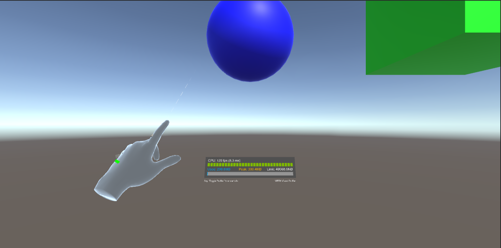

# hello_hololens

## 概要

HoloLens開発の1st stepとしてまず初期設定を行って基本的な機能を触ってみました。

- Cube: 触って動かすことができます。
- Sphere: 一度触ると重力がonになり、HoloLens2で空間認識した床に落ちます。

## 動作確認環境

- Unity 2021.3.7f1
- MRTK 2.8.2
- Microsoft Visual Studio Community 2019

## デプロイ手順

1. Unityのプロジェクトを起動する
1. サンプルシーンのロード(ProjectタブのAssets → Scenesにある`SampleScene`をダブルクリック)
1. File → Build Settingを開いて、Platformで`Universal Windows Platform`を選択
1. `Switch Platform`をクリック → `Build`をクリック
1. 出力されたファイルから`Hello_HoloLens2.sln`を選択して、Visual Studioを起動
1. ソリューションエクスプローラー → Hello HoloLens2(Universal Windows) → `Package.appxmanifest`を開いて、機能 → `空間認識`にチェックを入れる
1. ビルド構成でRelease, ARM, デバイスを選択してビルドを実行(HoloLens2はUSB接続しておくこと)
1. 実機上でアプリが起動！
